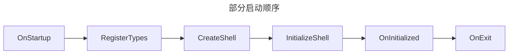

使用Prism时，一个最常见的问题就是登录与主页面切换，启用只有一个Shell，如何切换到另外一个Shell。



## Application.Current.MainWindow

通过Application.Current.MainWindow切换登录和主页面

`LoginView`为登录页面

`ShellView`为主页面

1. 在Bootstrapper里设置登录页面启动

    ```cs
    protected override DependencyObject CreateShell()
    {
        return Container.Resolve<LoginView>();
    }
    ```

2. 登录成功后

    ::: warning
    代码高亮处缺少时，无法使用IRegionManager中的导航功能
    :::

    ```cs{2,3}
    var shellView = _container.Resolve<ShellView>();
    RegionManager.SetRegionManager(shellView, _regionManager);
    RegionManager.UpdateRegions();
    Application.Current.MainWindow.Hide();
    Application.Current.MainWindow = shellView;
    shellView.Show();
    ```

## Region

通过Region添加LoginView和MainView

`LoginView`为登录布局

`MainView`为主页面布局

`ShellView`为主页面

1. 在Bootstrapper里设置Shell页面启动

    ```cs
    protected override DependencyObject CreateShell()
    {
        return Container.Resolve<ShellView>();
    }
    ```

2. ShellView页面

    ```xml
    <Window x:Class="Regions.Views.MainWindow"
            xmlns="http://schemas.microsoft.com/winfx/2006/xaml/presentation"
            xmlns:x="http://schemas.microsoft.com/winfx/2006/xaml"
            xmlns:prism="http://prismlibrary.com/"
            Title="Shell"
            Width="525"
            Height="350">
        <Grid>
            <ContentControl prism:RegionManager.RegionName="ContentRegion" />
        </Grid>
    </Window>
    ```

3. 登录成功后

    ::: warning
    无法在VM构造函数里直接使用`_regionManager.Regions["ContentRegion"]`

    可以替换为`_regionManager.RegisterViewWithRegion("ContentRegion", typeof(MainView))`
    :::

    ```cs
    var region = _regionManager.Regions["ContentRegion"];
    var hasView = region.GetView(nameof(MainView));
    var mainView=_region.Resolve<MainView>()
    if (hasView == null)
    {
        region.Add(mainView, nameof(MainView));
    }
    else
    {
        region.Activate(hasView);
    }
    ```

一个潜在的问题在于，登录布局页面与主页面布局大小可能不一致。但是启动时的Shell大小已定。

这里可以使用`IEventAggregator`，让Shell来调整页面大小。

## InitializeShell

`LoginView`为登录页面

`ShellView`为主页面

1. 在Bootstrapper里设置Shell页面启动

    ```cs
    protected override DependencyObject CreateShell()
    {
        return Container.Resolve<ShellView>();
    }
    ```

2. 在`Bootstrapper`里初始化Shell,设置登录页启动

    ```cs
    protected override void InitializeShell(DependencyObject shell)
    {
        var login = new LoginView();
        if (login.DataContext is LoginViewModel ctx)
        {
            ctx.LoginResult += (bool ret,string message) =>
            {
                if (ret)
                {
                    base.InitializeShell(shell);
                }
                else
                {
                    MessageBox.Show(message);
                }
            };
        }
        if (login.ShowDialog() != true)
        {
            Application.Current.Shutdown(-1);
        }
    }
    ```

## 自定义窗体

::: tip
需要安装预览版的Prism
:::

`LoginWindowView`:登录窗体载体

`LoginView`:登录窗体内的用户控件

`ShellWindowView`:主窗体

### 登录窗体

登录窗体为一个空白的窗体。

在启动项重写`RegisterTypes`方法，注入登录窗体和登录用户控件。

```cs{3-4}
protected override void RegisterTypes(IContainerRegistry containerRegistry)
{
    containerRegistry.RegisterDialogWindow<LoginWindowView>();
    containerRegistry.RegisterDialog<LoginView, LoginViewModel>();
}
```

需要在`LoginWindowView.xaml.cs`继承`IDialogWindow`接口

```cs{1,3}
public partial class LoginWindowView: IDialogWindow
{
    public IDialogResult Result { get; set ; }
    public LoginWindowView()
    {
        InitializeComponent();
    }
}
```

为了实现`LoginWindowView`里的导航功能，也需要更新`RegionManger`

```cs{5,8-9}
public partial class LoginWindowView: IDialogWindow
{
    public IDialogResult Result { get; set ; }

    public LoginWindowView(IRegionManager regionManager)
    {
        InitializeComponent();
        RegionManager.SetRegionManager(this, regionManager);
        RegionManager.UpdateRegions();
    }
}
```

注入需要的导航用户控件

```cs{3}
protected override void RegisterTypes(IContainerRegistry containerRegistry)
{
    containerRegistry.RegisterForNavigation<...>();
}
```

### 启动登录窗体

在启动项`PrismApplication`里重写`OnInitialized`方法

这里设置了`OK`代表登录成功,`None`或者`Cancel`代表退出登录窗体

```cs
protected override async void OnInitialized()
{
    var dialogService = Container.Resolve<IDialogService>();
    var result = await dialogService.ShowDialogAsync(nameof(LoginView));
    switch (result.Result)
    {
        case ButtonResult.OK:
            base.OnInitialized();
            return;
        case ButtonResult.None:
        case ButtonResult.Cancel:
            Environment.Exit(0);
            break;
    }
}
```

### 登录用户控件

最后在登录用户控件`LoginView`的VM里继承`BindableBase`和`IDialogAware`

一些通用的对话框代码如下

在`CloseDialog`方法里添加自己的登录逻辑处理结果

```cs{23-32}
public class LoginViewModel : BindableBase, IDialogAware
{
    private readonly IRegionManager _regionManager;
    private readonly IContainerExtension _container;
    public LoginViewModel(IEventAggregator eventAggregator,
        IRegionManager regionManager,
        IContainerExtension container)
    {
        _eventAggregator = eventAggregator;
        _regionManager = regionManager;
        _container = container;
    }

    private string _title = "登录";
    public string Title
    {
        get { return _title; }
        set { SetProperty(ref _title, value); }
    }

    public DialogCloseListener RequestClose { get; }

    protected virtual void CloseDialog(bool ret)
    {
        ButtonResult result = ButtonResult.None;
        if(ret){
            result=ButtonResult.Ok;
        }else{
            result=ButtonResult.Ignore;
        }
        RaiseRequestClose(new DialogResult(result));
    }

    public virtual void RaiseRequestClose(IDialogResult dialogResult)
    {
        RequestClose.Invoke(dialogResult);
    }

    public virtual bool CanCloseDialog()
    {
        return true;
    }

    public virtual void OnDialogClosed(){}

    public virtual void OnDialogOpened(IDialogParameters parameters){}
}
```
