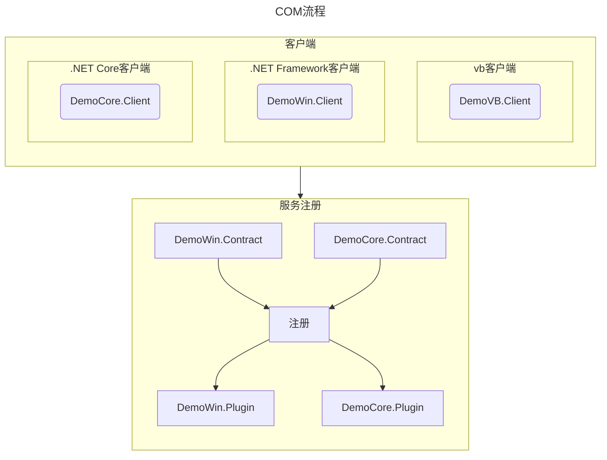
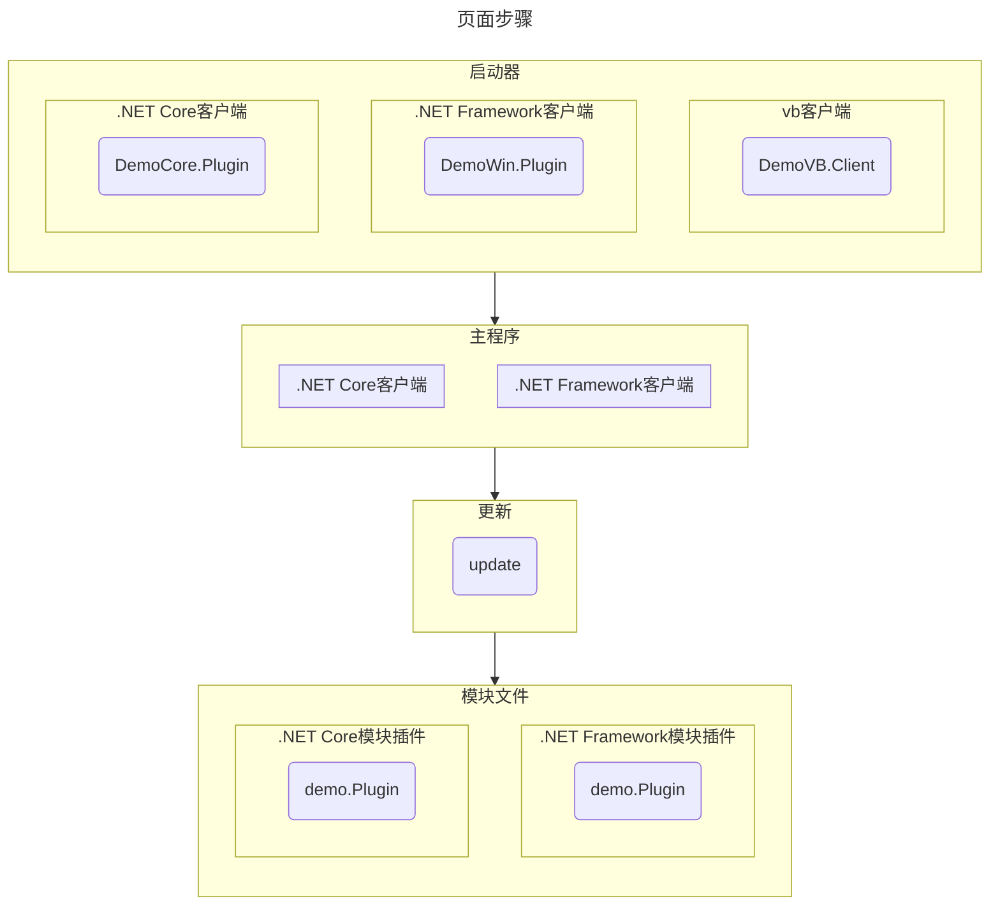

[Com激活说明](https://github.com/dotnet/runtime/blob/main/docs/design/features/COM-activation.md)

| Server | Client | Current Support |
| --- | --- | :---: |
| COM* | .NET Core | Yes |
| .NET Core | COM* | Yes |
| .NET Core | .NET Core | Yes |
| .NET Framework | .NET Core | No |
| .NET Core | .NET Framework | No |

* “COM”用于表示除 .NET 以外的任何 COM 环境（例如 C/C++）。

反射和直接引用都可以，[示例源代码地址](https://github.com/Ly2JR/wpf-samples/tree/main/src/ComDemo)

1. `DemoWin.Client`：.NETFramework Winform客户端
2. `DemoVB.Client`：VB客户端
3. `DemoWin.Contract`：.NETFramework公开服务
4. `DemoWin.Plugin`：.NETFramework和.NET Core服务实现
5. `DemoCore.Client`：.NETCore WPF客户端
6. `DemoCore.Contract`：.NETCore和.NETFramework公开服务
7. `DemoCore.Plugin`：.NET Core和.Net Framework服务实现
8. `Demo.Plugin`：模块插件
9. `update`：更新程序





::: tip

1. 更新程序需要放在对应的客户端目录下，因为是从当前客户端查找的...

2. 不在UI的COM很容易，带UI的COM比较复杂，特别是在IOC的UI...

:::

## VB与.NET Framework

::: tip

VB客户端放在哪里都无所谓，通过COM找到，即使通过`tlb`引入。

:::


### 定义GUID

```cs
public sealed class ContractGuids
{
    public const string ServerClass = "XXXX-XXX-XXX-XXXX";
    public const string ServerInterface = "XXXX-XXX-XXX-XXXX";
}
```

### 公开服务接口

```cs
[ComVisible(true)]
[Guid(ContractGuids.ServerInterface)]
[InterfaceType(ComInterfaceType.InterfaceIsIUnknown)]
public interface IServer
{
    void StartWin();
}
```

### 实现服务接口

```cs
[ComVisible(true)]
[Guid(ContractGuids.ServerClass)]
public class Server : IServer
{
    public void StartWin()
    {
        var login=new FrmLogin();
        login.ShowDialog();
    }
}
```

同时勾选项目属性`为COM互操作注册`，生成一个带`xxx.tlb`的文件

或者使用[Regasm.exe](https://learn.microsoft.com/zh-cn/dotnet/framework/tools/regasm-exe-assembly-registration-tool)

```shell
regasm xxx.dll /tlb:xxx.tlb
```

如无法找到，需要加上`/codebase`，即`regasm xxx.dll /tlb:xxx.tlb /codebase`

### 客户端调用

```vb
Dim obj As Object
'方式一：引用
'Set obj = New DemoWin_Plugin.Server
'obj.startwin

'方式二：反射
Set obj = CreateObject("DemoWin.Plugin.Server")
obj.startwin

set obj=Nothing
```

## .NET Core与.NET Core

[官网示例NET Core Com](https://learn.microsoft.com/zh-cn/dotnet/core/native-interop/expose-components-to-com#sample)


### .Net Core支持多框架

为了使`DemoCore.Contract`同时`.NET Core`和`.NET Framework`，默认新建的是.NET Core类库项目。

在[.NET Core与.Net Core Com调用](#net-core与-net-core)部分添加了`UseWPF`使其支持WPF，继续`编辑项目文件`，

将`<TargetFramework>net7.0-windows</TargetFramework>`

改成`<TargetFrameworks>net7.0-windows;net48</TargetFrameworks>`，

关闭项目，重新打开即可，与上诉流程类型，部分差异。

### 公开服务接口差异

这里使用的是WPF作为页面展示，`编辑项目文件`添加`<UseWPF>true</UseWPF>`，使接口能返回`Window`供客户端使用。

另外添加了一个`StartWpf`的方法，实现带Prism的启动，将[模块化](../../cs/wpf/plugin.md)的功能全部搬过来。

```cs
[ComVisible(true)]
[Guid(ContractGuids.ServerInterface)]
[InterfaceType(ComInterfaceType.InterfaceIsIUnknown)]
public interface IServer
{
    //页面直接使用
    Window StartCore();

    //Prism IOC使用
    void StartWpf();

    //不带UI的计算
    int Sum(int a,int b);
}
```

### 实现服务接口差异

这里使用的是WPF作为页面展示

`编辑项目文件`添加`<EnableComHosting>true</EnableComHosting>`，生成`xxxx.comhost.dll`文件。

使用[regsvr32](https://learn.microsoft.com/zh-cn/windows-server/administration/windows-commands/regsvr32)对`xxx.comhost.dll`进行注册。

`编辑项目文件`添加`<EnableRegFreeCom>true</EnableRegFreeCom>`，生成`XXXX..X.manifest`清单文件。

另外加了一个带`Prism`的启动，需要将`App.xml`文件右击属性调整为`页`。

::: tip

因为没有`app.xaml`作为启动项，所以app.xaml里的资源不能直接绑定了，需要单独使用。

这里是将[模块](../../cs/wpf/plugin.md)的所有功能都复制过来，只调整了一个`App.xaml`，导致IOC也是包含在里面。

正如`VB客户端`无法使用IOC，但是可以调用`StartWPF`作为整体启动。

另外`.NET Core客户端`已经有了`Application`，无法启用`StartWPF`，但是可以将IOC放在外部客户端上，调用`StartCore`方法

:::

```cs{7}
[ComVisible(true)]
[Guid(ContractGuids.ServerClass)]
public class Server : IServer
{
    /// <summary>
    /// 不带IOC
    /// </summary>
    public Window StartCore()
    {
        return new MainView();
    }

    /// <summary>
    /// 使用Prism
    /// </summary>
    public void StartWPF()
    {
        var app = new App();
        app.Run();
    }

    public int Sum(int a, int b)
    {
        return a + b;
    }
}
```

### 客户端调用差异

::: tabs

@tab .NET Core客户端

```cs
var caller = new Server();
var mainView= caller.StartCore();
mainView.ShowDialog();
Application.Current.MainWindow = mainView;
```

@tab .NET Core代理

```cs
// The following classes are typically defined in a PIA, but for this example
// are being defined here to simplify the scenario.
namespace Activation
{
    /// <summary>
    /// Managed definition of CoClass
    /// </summary>
    [ComImport]
    [CoClass(typeof(ServerClass))]
    [Guid(ContractGuids.ServerInterface)] // By TlbImp convention, set this to the GUID of the parent interface
    internal interface Server : IServer
    {
    }

    /// <summary>
    /// Managed activation for CoClass
    /// </summary>
    [ComImport]
    [Guid(ContractGuids.ServerClass)]
    internal class ServerClass
    {
    }
}
```

:::

## .NET Framework与.NET Core


无法使用.NET Core与.NET Core代理的方式调用，但是可以使用COM CLSID 找到。

```cs
var comType = Type.GetTypeFromCLSID(Guid.Parse(DemoCore.Contract.ContractGuids.ServerClass));
var active = System.Activator.CreateInstance(comType) as DemoCore.Contract.IServer;
//var sum=active.Sum(2,5);
//MessageBox.Show(sum.ToString());
var mainView=active.StartCore();
mainView.ShowDialog();
```

## .NET Framework与.NET Framework

这种用的不多，同一种语言，直接引用就行，或者也是用反射，或者通过COM CLSID


```cs
var comType = Type.GetTypeFromCLSID(Guid.Parse(ContractGuids.ServerClass));
var active = System.Activator.CreateInstance(comType) as IServer;
active.StartWin();
```

## VB与.NET Core


```vb
Dim obj As Object

Set obj = CreateObject("DemoCore.Plugin.Server")
obj.StartWpfCore

Set obj = Nothing
```
