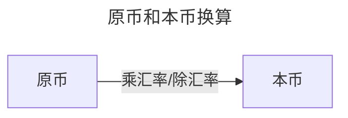
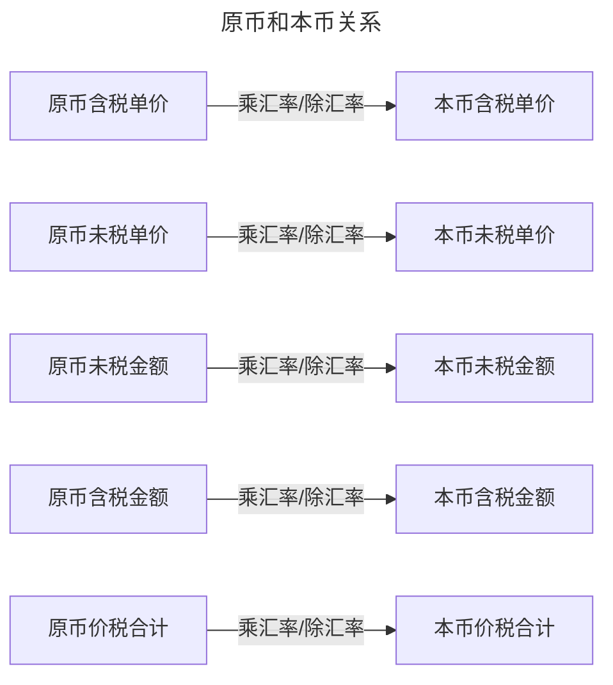
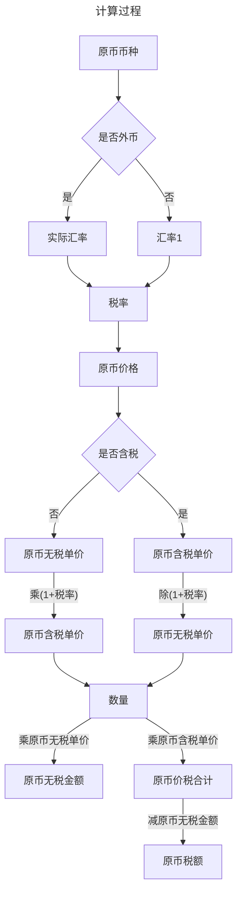

在一些系统中，经常需要计算各种价格，其中涉及到一些关键字

如`原币`、`本币`、`折算方式`、`汇率`、`税率`、`原币含税单价`、`原币无税单价`、`本币无税单价`、`本币无税金额`、`税额`、`金额`、`价税合计`、`是否含税`、

原币一般指外国货币，而本币默认指本国货币，汇率就是原币与本币之间的兑换关系，知道基本的信息就可以推导出其他信息。

通常需要知道原币信息，推导出本币信息。

::: tip
在计算过程，一个重要的点就是精度

在计算价格的时候，价格的精度往往比金额的金额高很多

比如价格精度保留4位或者6位小数，而金额精度保留2位小数
:::

## 流程

## 基本换算关系

###  原币与本币

根据`折算方式`的不同，执行不同的换算

折算方式只有`原币`和`本币`不一样时才需要。

分为`外币*汇率=本币`和`外币/汇率=本币`两种

### 原币含税单价与原币无税单价

`原币含税单价/(1+税率)=原币无税单价`

### 原币无税金额

`原币无税单价*数量=原币无税金额`

### 原币价税合计

`原币含税单价*数量=原币价税合计`

### 原币税额

`原币价税合计-原币无税金额=原币税额`

## 示例参考

|币种|汇率|税率|数量|原币含税单价|原币无税单价|原币金额|原币税额|原币价税合计|本币无税单价|本币无税金额|本币税额|本币价税合计|
|:-|:-|:-|:-|:-|:-|:-|:-|:-|:-|:-|:-|:-|
|美元|7.12650|13|10|70|61.9470|619.47|80.53|700|441.4650|4414.65|573.90|4988.55|
|人民币|1|13|10|70|61.9470|619.47|80.53|700|61.9470|619.47|80.53|700|

