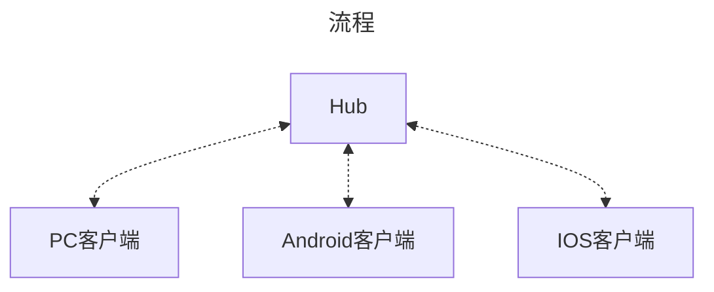

[SignalR](https://learn.microsoft.com/zh-cn/aspnet/core/signalr/introduction?view=aspnetcore-8.0)是一个很好的实时应用。

并且提供Android和IOS以及Web相关包。但是文档有点抽象，除非自己下手写才能更深的理解，这里疏浅的总结几个点，更快的理解SignalR，并配上示例代码。

## 要点

::: tip
Hub抽象代理，对参数名，参数类型需要完全一致
:::

SignalR通信围绕`Hub`展开，高度抽象，包括几个方面

### 中心



`Hub`提供两个代理方法,

- 发消息`SendAsync`
- 发消息以及响应`InvokeAsnyc`

不同点:

`InvokeAsnyc`可以接收客户端的响应，而`SendAsync`只管发。

`Hub`主要使用流程大体分为三种

- 一端发消息、一端收消息

- 一端发消息，并直接响应、一端只收消息

- 一端发消息，并得到另一个端的实时响应

   1. 第一种是通过一端只发一端只收，改成即发也收，人为参与的情况。

   2. 第二种是发完消息后需要立马得到客户端的响应，比如`自动唤醒`。

那么又如何区分谁向谁发，谁来接收的问题？

在于Clients.[客户端对象](https://learn.microsoft.com/zh-cn/aspnet/core/signalr/hubs?view=aspnetcore-8.0#the-clients-object)。

常见的有:

发起者客户端：`Clients.Caller`

除发起者外的所有客户端：`Clients.Others`

指定客户端：`Clients.Client(ConnectionId)`

### 客户端

客户端都是通过代理调用`Hub`方法实现。

客户端除了`Hub`有的`SendAsync`和`InvokeAsync`之外还有，`On`方法。

- 客户端A向客户端B发消息

    ```mermaid
    ---
    title: 一端发，一端收
    ---
    flowchart LR
    客户端A-.发消息.->Hub
    Hub -.接收消息.-> 客户端B
    ```

    涉及三端`Hub`、`客户端A`、`客户端B`

  - Hub端

    ```cs{1,2}
    public Task SendToClientB(string msg){
        await Clients.Others.SendAsync("ReceiveClientAMessage",msg)
    }
    ```

  - PC客户端A`发起者`

    ```cs
    HubConnection.SendAsync("SendToClientB","Hello");
    ```

    客户端A向客户端B发送消息，调用`Hub`中心的`SendToClientB`方法，发送内容为`Hello`

  - PC客户端B`接收者`

    ```cs
    HubConnection.On<string>("ReceiveClientAMessage",(msg)=>{
        Console.WriteLine(msg);
    });
    ```

    客户端B接收消息，监听`ReceiveClientAMessage`方法，并带有一个`string`参数。

    ::: tip
    这里任何客户端调用`HubConnection.SendAsync("SendToClientB","Hello");`，客户端B都能收到消息。

    除非在`Hub`的`SendToClientB`方法里将`Clients.Others`改为指定客户端B的连接才行`Clients.Client(ClientB.ConnectedId)`
    :::

- 客户端A向客户端B发消息，同时客户端A确认已接收消息

    ```mermaid
    ---
    title: 一端发消息，并直接响应、一端只收消息
    ---
    flowchart LR
    客户端A -.发消息.-> Hub
    Hub -.接收消息.-> 客户端B
    Hub -.发送成功.->客户端A
    ```

    涉及三端`Hub`、`客户端A`、`客户端B`

  - Hub端

    ```cs{1,3}
    public Task<string> SendToClientB(string msg){
        await Clients.Others.SendAsync("ReceiveClientAMessage",msg)
        return "已收到"；
    }
    ```

  - PC客户端A`发起者`

    ```cs
    var clientB= HubConnection.InvokeAsync("SendToClientB","Hello");
    Console.WriteLine(clientB);
    ```

    客户端A向客户端B发送消息，调用`Hub`中心的`SendToClientB`方法，发送内容为`Hello`，并接收`Hub`的响应。

  - PC客户端B`接收者`

    ```cs
    HubConnection.On<string>("ReceiveClientAMessage",(msg)=>{
        Console.WriteLine(msg);
    });
    ```

- 客户端A向客户端B发消息，客户端B收到消息后，向客户端A发送它的反馈

     ```mermaid
    ---
    title: 一端发消息，并得到另一个端的实时响应
    ---
    flowchart LR
    客户端A -.发消息.-> Hub
    Hub -.接收消息.-> 客户端B
    客户端B -.确认已接收.-> Hub
    Hub -.接收客户端B消息.->客户端A
    ```

    涉及三端`Hub`、`客户端A`、`客户端B`

  - Hub端

    ```cs{1,2}
    public Task<string> GetClientMsg(){
        var ret= await Clients.Caller.InvokeAsync("GetMessage")
        return ret;
    }
    ```

  - PC客户端A`响应者`

    ```cs
    HubConnection.On<string>("GetMessage",()=>{
       retrun "客户端A已收到";
    });
    ```

    客户端A订阅`Hub`中的`GetMessage`方法，并返回结果。

  - PC客户端B`接收者`

    ```cs
    HubConnection.On<string>("GetMessage",()=>{
       retrun "客户端B已收到";
    });
    ```

    客户端B订阅`Hub`中的`GetMessage`方法，并返回结果。

### [强类型中心](https://learn.microsoft.com/zh-cn/aspnet/core/signalr/hubs?view=aspnetcore-8.0#strongly-typed-hubs)

提供了`Hub<T>`接口用于解决`Hub`中的硬编码问题。

```cs
public interface IHubChat{
    Task ReceiveClientAMessage(string msg);
    Task ReceiveClientBMessage(string msg);
    Task<string> GetMessage();
}
```

```cs
public class ChatHub:Hub<IChatHub>
{
}
```

硬编码

```cs
//发消息
await Clients.Others.SendAsync("ReceiveClientAMessage",msg)
//发消息
await Clients.Others.InvokeAsync("ReceiveClientBMessage",msg)
//发消息并接收消息
await Clients.Caller.InvokeAsync<string>("GetMessage")
```

强中心

```cs
//发消息
await Clients.Others.ReceiveClientAMessage(msg)
//发消息
await Clients.Others.ReceiveClientBMessage(msg)
//发消息冰接收消息
await Clients.Caller.GetMessage(msg)
```

## 实时通信示例

以一个简单的聊天对话为例，包含以下功能

- [x] 强类型中心
- [x] 实时通信
- [x] 唤醒
- [x] SignalR日志
- [x] 通过API使用SignalR


::: tip
提示"发生一个或多个错误，未能启动调试适配器。可以在输出窗口中查看额外的信息。"时

在工具\选项\调试\常规\对ASP.NET启用JavaScript调试(Chrome、Edge和IE)中，取消即可。
:::

- 定义强类型接口

```cs
public interface IChatHub
{
    //接收消息
    Task GetHubMessage(string clientId, string message);

    //接收指定客户端
    Task<string> InvokeClientMessage(CancellationToken token=default);
}
```

- 引用`Microsoft.AspNetCore.SignalR`

```cs
using Microsoft.AspNetCore.SignalR;
```

- 继承`Hub<T>`

```cs
public class ChatHub:Hub<IChatHub>
{
}
```

在`ChatHub`里处理所有客户端之间的的交互。

主要有两个，发消息和接收消息，他们都依赖`Hub`，提供了各种方法

- 发送消息：`SendAsync`

    ```cs
    public async Task SendMessage(string user, string message)
        => await Clients.All.SendAsync("ReceiveMessage", user, message);
    ```

    通过发送消息`SendAsync`实现不同客户端的消息发送

  - 客户端A发送消息到客户端B
  - 客户端B发送消息到客户端A
  - ...

  如何确认哪个客户端，以及发送给哪个客户端？

  这时就需要`Hub.Context`上下文。

  重写`OnConnectedAsync`和`OnDisconnectedAsync`方法，并通过`Context.GetHttpContext()`获取到客户端连接。

- 接收消息：`InvokeAsync`

  接收消息与发送消息类似，具体示例放在API部分。

### 日志

添加`Serilog`日志记录所有情况

引用`Serilog`、`Serilog.AspNetCore`、`Serilog.Sinks.Async`、`Serilog.Sinks.File`四个包

将以下代码放在`Program`顶层

```cs
Log.Logger = new LoggerConfiguration()
    .WriteTo.Console()
    .WriteTo.Async(f => f.File("Logs\\log-.txt",
    outputTemplate: "{Timestamp:yyyy-MM-dd HH:mm:ss.fff zzz}[{Level:u3}] {Message:lj}{NewLine}{Exception}",
    rollingInterval: RollingInterval.Day))
    .MinimumLevel.Information()
    .CreateLogger();
```

启用日志

```cs
builder.Host.UseSerilog();//日志
...
app.UseSerilogRequestLogging();
```

### ChatHub

通过上下文得知，客户端连接时会自动携带一个唯一ID，例如`id=r22i63i8cd9xALATOW9HhA`。

因此，继续新增两个属性`user`标识身份，`type`标识身份类型`0:普通客户端`，`1:管理员客户端`，作为简单身份验证。

为了统一管理，新建`ChatManager`类，记录所有客户端的连接断开情况。

- 客户端用户类

```cs
public class User
{
    public User() { }

    public User(string? userId, uint userType, string? intime)
    {
        this.UserId = userId;
        this.UserType = userType;
        this.InTime = intime;
    }

    //自定义用户ID
    public string? UserId { get; set; }
    //SignalR唯一标识
    public string? ConnectionId { get; set; }
    //自定义用户类型
    public uint UserType { get; set; }
    //连接时间
    public string? InTime { get; set; }
}
```

- 聊天管理类

```cs
public class ChatManager
{
    private readonly ConcurrentDictionary<string, User> _chatRoom;
    private readonly ILogger<ChatManager> _logger;
    private const string TimeFormat = "HH:mm:ss";
    public ChatManager(ILogger<ChatManager> logger, ConcurrentDictionary<string, User> chatRoom)
    {
        _logger = logger;
        _chatRoom = chatRoom;
    }

    public User? this[string connectionId]
    { get { return _chatRoom[connectionId]; } }

    public User? Get(string userId)
    {
        return _chatRoom.Values.FirstOrDefault(u => u.UserId == userId);
    }


    public List<User> GetAll()
    {
        var onlineUsers = _chatRoom.Values.OrderBy(o => o.InTime);
        return onlineUsers.ToList();
    }

    public void AddOrUpdate(string connectionId, string userId, uint type = 0)
    {
        _chatRoom.AddOrUpdate(connectionId, new User()
        {
            UserId = userId,
            ConnectionId = connectionId,
            UserType = type,
            InTime = DateTime.Now.ToString(TimeFormat),
        }, (k, o) =>
        {
            o.UserId = userId;
            o.ConnectionId = connectionId;
            o.UserType = type;
            o.InTime = DateTime.Now.ToString(TimeFormat);
            return new User() { ConnectionId = connectionId, UserType = type };
        });
        _logger.LogInformation($"房间管理:用户ID:{userId},用户类型:{type}进入房间");
    }

    public void Remove(string connectionId)
    {
        if (_chatRoom.TryRemove(connectionId, out var v))
        {
            _logger.LogInformation($"房间管理:移除用户ID:{v.UserId},用户类型:{v.UserType},进入时间:{v.InTime},离开时间:{DateTime.Now.ToString(TimeFormat)}");
        }
        else
        {
            _logger.LogInformation($"房间管理:移除用户失败");
        }
    }
}
```

- 重写`OnConnectedAsync`

```cs
public override async Task OnConnectedAsync()
{
    var ctx = Context.GetHttpContext();
    if (ctx != null)
    {
        if (!ctx.Request.Query.TryGetValue("user", out var oName))
        {
            _logger.LogWarning($"非法用户连接到服务中心");
            Context.Abort();
            return;
        }
        var userId = oName.FirstOrDefault();
        if (string.IsNullOrEmpty(userId))
        {
            _logger.LogWarning($"非法用户连接到服务中心");
            Context.Abort();
        }
        var type = "";
        if (ctx.Request.Query.TryGetValue("type", out var oType))
        {
            type = oType.FirstOrDefault();
        }
        _logger.LogInformation($"用户ID[{userId}],ID[{Context.ConnectionId}],用户类型:{type}连接到服务中心");
        _chatManager.AddOrUpdate(Context.ConnectionId, userId!, string.IsNullOrEmpty(type) ? 0u : 1u);
    }
    await base.OnConnectedAsync();
}
```

- 重写`OnDisconnectedAsync`

```cs
public override Task OnDisconnectedAsync(Exception? exception)
{
    var ctx = Context.GetHttpContext();
    if (ctx != null)
    {
        if (ctx.Request.Query.TryGetValue("user", out var oName))
        {
            _logger.LogInformation($"用户[{oName.FirstOrDefault()}],ID[{Context.ConnectionId}]断开连接");
        }
        _chatManager.Remove(Context.ConnectionId);
    }
    return base.OnDisconnectedAsync(exception);
}
```

- 向其他客户端发送消息,并返回结果

`6行`：获取调用者用户，通过`user`指定用户

`9行`：没法用户直接返回

`17`：通过重写`OnConnectedAsync`获取到当前用户的ID并且管理起来

`21`：客户端A向客户端发消息时，客户端B不在线时，需要告知客户端A

`23`：向客户端B发送消息

`27`：当客户端B接收消息并返回它的消息

```cs{6,9,17,21,23,27}
public async Task<string> SendToClientAndReceive(string clientId, string message)
{
    var ctx = Context.GetHttpContext();
    if (ctx != null)
    {
        if (!ctx.Request.Query.TryGetValue(Contracts.FLAG_NAME, out var oName))
        {
            _logger.LogInformation($"非法用户向客户端发送消息：{message}");
            return "非法用户";
        }
        else
        {
            var cancelTokenSource = new CancellationTokenSource();
            cancelTokenSource.CancelAfter(3000);

            var currentClientUser = oName.FirstOrDefault();
            var host = _chatManager.Get(clientId);
            if (host is null)
            {
                _logger.LogInformation($"客户端用户[{currentClientUser}]向客户端[{clientId}]发送消息：{message},但客户端[{clientId}]不在线");
                return $"客户端[{clientId}]不在线";
            }
            await Clients.Client(host.ConnectionId!).GetHubMessage(currentClientUser, message);
            _logger.LogInformation($"客户端用户[{currentClientUser}]向成功客户端[{clientId}]发送消息：{message}");
            
            //来自客户端的响应
            var msg = await Clients.Caller.InvokeClientMessage(cancelTokenSource.Token);
            return msg;
        }
    }
    return "非法用户";
}
```

### 集成到API中

```cs
builder.Services.AddSingleton<ChatManager>();
builder.Services.AddSingleton<ConcurrentDictionary<string, User>>();
builder.Services.AddSignalR();
builder.Services.AddCors(option => option.AddPolicy("SignalR", builder =>
{
    builder.AllowAnyMethod()
    .AllowAnyHeader()
    .SetIsOriginAllowed(origin => true)
    .AllowCredentials();
}));

...

var app = builder.Build();
app.MapHub<ChatHub>("/chathub", options =>
{
    options.Transports = HttpTransportType.WebSockets |
    HttpTransportType.LongPolling;
});
app.UseCors("SignalR");
```

### 完整Program

完整`Program.cs`

```cs
using Microsoft.AspNetCore.Http.Connections;
using Microsoft.AspNetCore.Identity;
using Microsoft.AspNetCore.Mvc;
using Serilog;
using SignalrApi;
using SignalrApi.Models;
using System.Collections.Concurrent;
using System.Text.Json.Serialization;

Log.Logger = new LoggerConfiguration()
    .WriteTo.Console()
    .WriteTo.Async(f => f.File("Logs\\log-.txt",
    outputTemplate: "{Timestamp:yyyy-MM-dd HH:mm:ss.fff zzz}[{Level:u3}] {Message:lj}{NewLine}{Exception}",
    rollingInterval: RollingInterval.Day))
    .MinimumLevel.Information()
    .CreateLogger();

try
{
    var builder = WebApplication.CreateSlimBuilder(args);
    builder.Host.UseSerilog();//日志
    builder.Services.AddSingleton<ChatManager>();
    builder.Services.AddSingleton<ConcurrentDictionary<string, User>>();
    builder.Services.AddSignalR();
    builder.Services.AddCors(option => option.AddPolicy("SignalR", builder =>
    {
        builder.AllowAnyMethod()
        .AllowAnyHeader()
        .SetIsOriginAllowed(origin => true)
        .AllowCredentials();
    }));
    builder.Services.ConfigureHttpJsonOptions(options =>
    {
        options.SerializerOptions.TypeInfoResolverChain.Insert(0, AppJsonSerializerContext.Default);
    });

    var app = builder.Build();
    app.MapHub<ChatHub>("/chathub", options =>
    {
        options.Transports = HttpTransportType.WebSockets |
        HttpTransportType.LongPolling;
    });
    app.UseCors("SignalR");
    app.UseSerilogRequestLogging();

    app.Run();
}
catch (Exception ex)
{
    Log.Fatal(ex, "Application terminated unexpectedly");
}
finally
{
    Log.CloseAndFlush();
}

[JsonSerializable(typeof(List<User>))]
internal partial class AppJsonSerializerContext : JsonSerializerContext
{
}
```

### 客户终端

- 主程序

```cs
using Microsoft.AspNetCore.SignalR.Client;

HubConnection connection=null;
string temp=string.Empty;
Console.Clear();
var suc=await ConnectAsync();
if (!suc) return;
ConsoleKeyInfo pressKey;
Console.CancelKeyPress += Console_CancelKeyPress;

void Console_CancelKeyPress(object? sender, ConsoleCancelEventArgs e)
{
    e.Cancel = true;
}

do
{
    Console.WriteLine("按Q键退出程序，或CTRL+C中断操作");
    pressKey = Console.ReadKey(true);

    Console.Write("向客户端B发送消息:");
    var msg = Console.ReadLine();
    if (connection != null)
    {
        var clientB =await connection.InvokeAsync<string>("SendToClientAndReceive", "clientB", msg);
        Console.WriteLine(clientB);
    }
} while (pressKey.Key != ConsoleKey.Q);
await CloseConnectionAsync();
```

- 连接

```cs
async Task<bool> ConnectAsync()
{
    try
    {
        connection = new HubConnectionBuilder()
        .WithUrl("http://localhost:5214/chathub?user=clientB&type=1")
        .WithAutomaticReconnect()
        .Build();
        connection.On<string, string>("GetHubMessage", (userId, msg) =>
        {
            Console.WriteLine($"来自客户端B[{userId}]消息:{msg}");
        });
        connection.On("InvokeClientMessage", () =>
        {
            return "客户端B已收到";
        });
        await connection.StartAsync();
        Console.WriteLine("客户端[clientB]成功连接到chathub");
        return true;
    }
    catch (Exception ex)
    {
        Console.WriteLine($"启动异常:{ex.Message}");
    }
    return false;
}
```

- 断开连接

```cs
async Task CloseConnectionAsync()
{
    if (connection != null)
    {
        if (connection.State != HubConnectionState.Disconnected)
        {
            await connection.StopAsync();
        }
        await connection.DisposeAsync();
    };
    Console.WriteLine("离开chathub");
}
```

### API调用

虽然使用了`SignalR`，并且也提供了其他平台的支持，但是也可以对`SignalR`部分封装，通过API的方式使用。

- 消息载体

```cs
public record PostMsg(string receiver, string sender, string sendMsg);
```

- 查看所有在线客户端

```cs
var chatApi = app.MapGroup("/chat");
chatApi.MapGet("/", ([FromServices] ChatManager chatManager) =>Results.Ok(chatManager.GetAll()));
```


- 向指定客户端发送消息

```cs
 chatApi.MapPost("/SendTo", async (PostMsg msg, [FromServices] IHubContext<ChatHub> ctx, [FromServices] ChatManager chatManager) =>
 {
     var host = chatManager.Get(msg.receiver);
     if (host is not null)
     {
         await ctx.Clients.Client(host.ConnectionId!).SendAsync(Contracts.SendClientMessage, msg.sender, msg.sendMsg);
         return Results.Ok("Ok");
     }
     return Results.Ok("Offline");
 });
```


- 向指定客户端发送消息并接收客户端响应消息

```cs
 chatApi.MapPost("/SendAndReceive", async (PostMsg msg, [FromServices] IHubContext<ChatHub> ctx, [FromServices] ChatManager chatManager) =>
 {
     var host = chatManager.Get(msg.receiver);
     if (host is not null)
     {
         await ctx.Clients.Client(host.ConnectionId!).SendAsync(Contracts.SendClientMessage, msg.sender, msg.sendMsg);
         var cancelTokenSource = new CancellationTokenSource();
         cancelTokenSource.CancelAfter(3000);
         var ret = await ctx.Clients.Client(host.ConnectionId!).InvokeAsync<string>(Contracts.GetClientMessage,cancelTokenSource.Token);
         return Results.Ok(ret);
     }
     return Results.Ok("Offline");
 });
```


## 其他

[示例源代码地址](https://github.com/ly2jr/SignalrApi)
