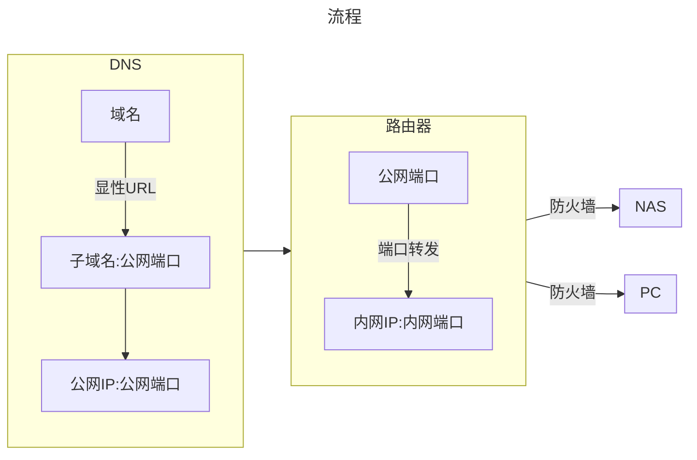

私有云部署离不开[Docker](https://www.docker.com/)和[nginx](https://nginx.org/en/)

以群晖为例:

## 域名无法访问私有云

`Q`：一切配置正常，解析正常，测试正常，但就是无法通过域名访问私有云?

`A`：`80`和`443`端口不对个人开放，需要加上非`80`和`443`端口。

## 私有云动态IP问题

域名绑定的是静态IP，但是私有云是动态的，体现在重启光猫后IP地址变动。

1. 在套件中心选择`Docker`安装
2. 在注册表搜索`chenhw2/aliyun-ddns-cli:latest`，或者[参考阿里云ddns](../docker/aliyun_ddns.md)并安装
3. 进入阿里云[RAM访问控制](https://ram.console.aliyun.com/overview)添加新用户，勾选`OpenApi调用访问`

    

4. 编辑基本信息，选择权限管理，个人权限，新增授权，选择`管理云解析(DNS)的权限`

   

5. 记住新用户的`AccessKey ID`和`AccessKey Secret`
6. 在群晖Docker容器选项中，创建容器，选择`chenhw2/aliyun-ddns-cli:latest`

   

7. 网络，选择默认`bridge`

    

8. 常规设置，点击高级设置

    AKID：对应用户的`AccessKey ID`

    AKSCT：应用用户的`AccessKey Secret`

    DOMAIN：对应自己的域名

    

当前私有云地址变更时，会自动添加一条记录到阿里云的DNS解析里。

可以通过重启光猫，或者删除阿里云DNS所有解析，登录10分钟就能看到。

## 私有云加域名和SSL

### NAS配置

1. 登录门户

    DSM端口(HTTP)：`自定义端口`

    DSM端口(HTTPS)：`自定义端口`

    `勾选`自动将DSM桌面的HTTP连接重定向到HTTPS

2. 安全性

    1. 证书

        新增，导入SSL证书

        设置，证书选择导入的SSL证书

    2. 防火墙

        配置出入站端口
  
### 路由器配置

设置端口转发

## 不输入端口访问私有云

::: tip
子域名在主域名下，由于已经购买了一个域名，在解析设置时直接填写想要的子域名即可。

别忘了申请子域名对应的SSL证书。
:::

需要明确的是，不输入端口是无法直接访问私有云的。

不能直接访问可以间接访问，通过输入主域名，跳转到子域名+端口上

例如：域名`a.com`，子域名`aa.a.com`，私有云内网IP`192.168.173.3:88`，公网域名:`aa.a.com:88`

在浏览器上输入`a.com`自动跳转`aa.a.com:88`，也就解决了`域名无法访问私有云`的问题。

在[域名配置](./domain.md)上，其中有个解析设置，额外添加一条记录：

记录类型：`显性URL-将域名重定向到另外一个地址`

主机记录：`@`

记录值：`302`：`子域名加端口`

